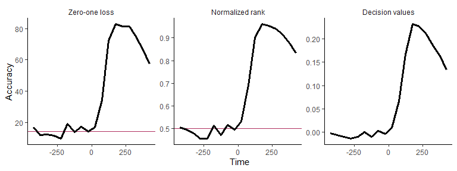
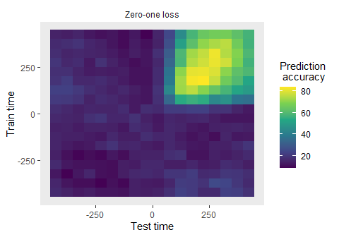
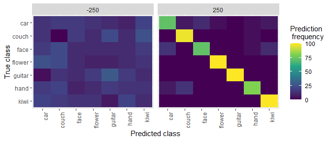

<!-- README.md is generated from README.Rmd. Please edit that file -->

# NeuroDecodeR: Neural Decoding in R

<!-- badges: start -->

[](https://github.com/emeyers/NeuroDecodeR/actions/workflows/R-CMD-check.yaml)
[](https://ci.appveyor.com/project/emeyers/NeuroDecodeR)
[](https://coveralls.io/github/emeyers/NeuroDecodeR)
<!-- badges: end -->

<p>

## Overview

*Neural decoding* is a data analysis method that uses pattern
classifiers to predict experimental conditions based on neural activity.
The NeuroDecodeR package makes it easy to do neural decoding analyses in
R.

## Installation

You can install NeuroDecodeR package from github using:

``` r
# install.packages("devtools")
devtools::install_github("emeyers/NeuroDecodeR")
```

## Documentation

The documentation for this package is available at:
<https://emeyers.github.io/NeuroDecodeR/>

To get started we recommend you read the [introductory
tutorial](https://emeyers.github.io/NeuroDecodeR/articles/introduction_tutorial.html)

## Usage

The package is based on 5 abstract object types:

1.  `Datasources (DS)`: generate training and test sets.
2.  `Feature preprocessors (FP)`: apply preprocessing to the training
    and test sets.
3.  `Classifiers (CL)`: learn relationships on the training set and make
    predictions on the test data.
4.  `Result Metrics (RM)`: summarize the prediction accuracies.
5.  `Cross-validators (CV)`: take the DS, FP and CL objects and run a
    cross-validation decoding procedure.

By combing different versions of these 5 object types together, it is
possible to run a range of different decoding analyses.

Below is a brief illustration of how to use the NDR to do a simple
decoding analysis. To learn how to use the NDR please see the
[documentation website](https://emeyers.github.io/NeuroDecodeR/) and the
package vignettes.

``` r
library(NeuroDecodeR)

# file to data in "binned format"
basedir_file_name <- system.file(file.path("extdata", "ZD_150bins_50sampled.Rda"), 
                                 package="NeuroDecodeR")

# create the DS, FP, CL, RM, and CV objects
ds <- ds_basic(basedir_file_name, 'stimulus_ID', 5, num_label_repeats_per_cv_split = 3)
#> Automatically selecting sites_IDs_to_use. Since num_cv_splits = 5 and num_label_repeats_per_cv_split = 3, all sites that have 15 repetitions have been selected. This yields 132 sites that will be used for decoding (out of 132 total).

fps <- list(fp_zscore())
cl <- cl_max_correlation()
rms <- list(rm_main_results(), rm_confusion_matrix())
cv <- cv_standard(datasource = ds, 
                  classifier = cl, 
                  feature_preprocessors = fps, 
                  result_metrics = rms, 
                  num_resample_runs = 2)  # better to use more resample runs for actual analyses (default is 50)

# run a decoding analysis (this takes a few minutes) 
DECODING_RESULTS <- run_decoding(cv)
#>   |                                                                              |                                                                      |   0%  |                                                                              |===================================                                   |  50%  |                                                                              |======================================================================| 100%
```

``` r
# plot the results for three different result types
plot(DECODING_RESULTS$rm_main_results, results_to_show = 'all', type = 'line')
```



``` r
# create a temporal cross decoding plot
plot(DECODING_RESULTS$rm_main_results)
```



## Running an analysis using pipes (\|\>)

One can also run a decoding analysis using the pipe (\|\>) operator to
string together the different NDR objects as shown below.

``` r

basedir_file_name <- system.file(file.path("extdata", "ZD_500bins_500sampled.Rda"), package="NeuroDecodeR")
  
  DECODING_RESULTS <- basedir_file_name |>
    ds_basic('stimulus_ID', 6, num_label_repeats_per_cv_split = 3) |>
    cl_max_correlation() |>
    fp_zscore() |>
    rm_main_results() |>
    rm_confusion_matrix() |>
    cv_standard(num_resample_runs = 2) |>
    run_decoding()
#> Automatically selecting sites_IDs_to_use. Since num_cv_splits = 6 and num_label_repeats_per_cv_split = 3, all sites that have 18 repetitions have been selected. This yields 132 sites that will be used for decoding (out of 132 total).
#>   |                                                                              |                                                                      |   0%  |                                                                              |===================================                                   |  50%  |                                                                              |======================================================================| 100%
  
  plot(DECODING_RESULTS$rm_confusion_matrix)
```


